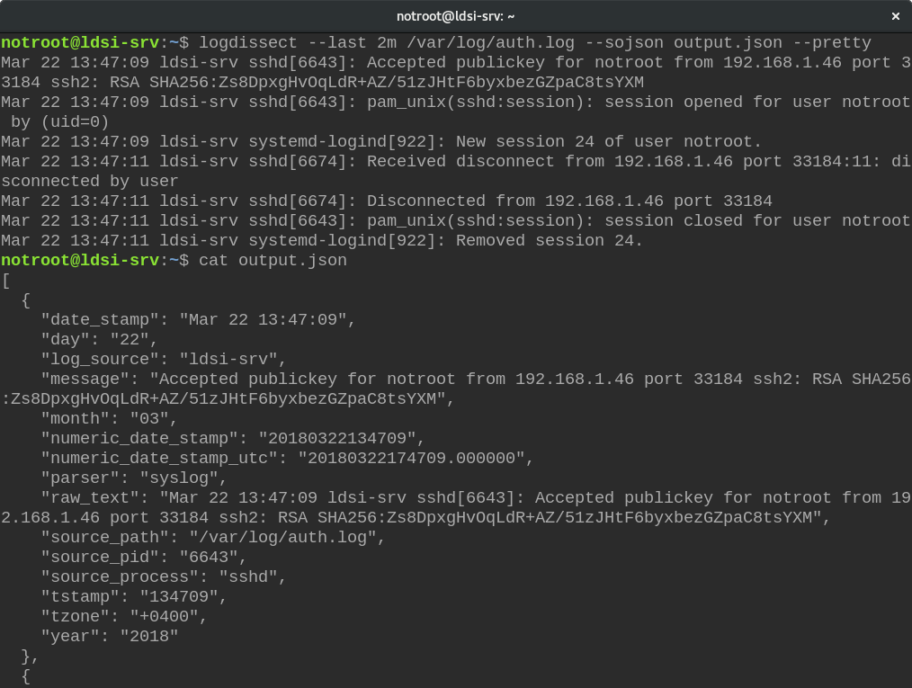

# logdissect

## Index

- [Introduction](#introduction)
  - [Description](#description)
  - [Installing](#installing)
- [Usage](#usage)
  - [Options](#options)
  - [Parsers](#parsers)
  - [Examples](#examples)
  - [Notes](#notes)
- [Community](#community)
  - [Module](#api)
  - [Support](#support)
  - [Contributing](#contributing)
- [Copyright](#copyright)

For library documentation, see the [module documentation](docs/README-MODULE.md).

# Introduction

## Description
Logdissect is a CLI utility and Python library for analyzing log files and other data. It can parse, merge, filter, and export data (to log files, or JSON).



## Installing
To install the latest release, see the latest instructions on the [releases page](https://github.com/dogoncouch/logdissect/releases). To install the development source, see the instructions in [CONTRIBUTING.md](docs/CONTRIBUTING.md#installing-development-source).

# Usage

## Options
```
usage: logdissect.py [-h] [--dhost DHOST] [--grep PATTERN] [--last LAST]
                     [--process PROCESS] [--protocol PROTOCOL] [--range RANGE]
                     [--utc] [--rdhost DHOST] [--rgrep PATTERN]
                     [--rprocess PROCESS] [--rprotocol PROTOCOL]
                     [--rshost SHOST] [--rsource SOURCE] [--shost SHOST]
                     [--source SOURCE] [--linejson LINEJSON] [--outlog OUTLOG]
                     [--label LABEL] [--sojson SOJSON] [--pretty] [--version]
                     [--verbose] [-s] [--list-parsers] [-p PARSER] [-z]
                     [-t TZONE]
                     [file [file ...]]

positional arguments:
  file                  specify input files

optional arguments:
  -h, --help            show this help message and exit
  --version             show program's version number and exit
  --verbose             set verbose terminal output
  -s                    silence terminal output
  --list-parsers        return a list of available parsers
  -p PARSER             select a parser (default: syslog)
  -z, --unzip           include files compressed with gzip
  -t TZONE              specify timezone offset to UTC (e.g. '+0500')

filter options:
  --dhost DHOST         match a destination host
  --grep PATTERN        match a pattern
  --last LAST           match a preceeding time period (e.g. 5m/3h/2d/etc)
  --process PROCESS     match a source process
  --protocol PROTOCOL   match a protocol
  --range RANGE         match a time range (YYYYMMDDhhmm-YYYYMMDDhhmm)
  --utc                 use UTC for range matching
  --rdhost DHOST        filter out a destination host
  --rgrep PATTERN       filter out a pattern
  --rprocess PROCESS    filter out a source process
  --rprotocol PROTOCOL  filter out a protocol
  --rshost SHOST        filter out a source host
  --rsource SOURCE      filter out a log source
  --shost SHOST         match a source host
  --source SOURCE       match a log source

output options:
  --linejson LINEJSON   set the output file for line by line JSON output
  --outlog OUTLOG       set the output file for standard log output
  --label LABEL         set label type for OUTLOG (fname|fpath)
  --sojson SOJSON       set the output file for single object JSON output
  --pretty              use pretty formatting for sojson output
```

## Parsers
Output of `--list-parsers` option:
```
==== Available parsing modules: ====

ciscoios        : cisco ios parsing module
emerge          : gentoo emerge log parsing module
linejson        : logdissect object-per-line JSON parsing module
sojson          : logdissect single object JSON parsing module
syslog          : syslog (standard timestamp) parsing module
syslogiso       : syslog (ISO timestamp) parsing module
syslognohost    : syslog (standard timestamp, no host) parsing module
tcpdump         : tcpdump terminal output parsing module
webaccess       : web access log parsing module
windowsrsyslog  : windows rsyslog agent log parsing module
```

## Examples
    
    logdissect --last 10m auth.log
    logdissect --last 1h --process systemd --process CRON messages
    logdissect -v --range 20160202020202-20170227213200 --label fpath messages debug apache2/error.log
    logdissect -s --outlog myaccess.log --grep 192.168.1.56 --last 30d --label fname /var/log/apache2/access.log /var/log/apache2/other_vhosts_access.log

## Notes
1. metadata: logdissect uses file modification times to assign years to syslog date stamps. This allows it to parse logs that span more than one year without a problem. If you are copying log files, always use `` cp -p `` (or `` cp --preserve=timestamps `` ) and `` scp -p `` to preserve original mtimes and other file metadata.

2. Re-parsing: If you are planning on parsing an output file back into logdissect at some point, using JSON is highly recommended. The JSON output modules use date stamps that include a year. Re-parsing a standard log output file will cause problems if the file has a different mtime than the original logs.

3. --range shortcuts: The range module will fill in your ranges with zeroes if they are shorter than 14 characters. If you want to get a range of 20170204120000 to 20170204130000, you can save time and use 2017020412 and 2017020413.

4. --last options: The last option should be a number followed by either 's' for seconds, 'm' for minutes, 'h' for hours, or 'd' for days (e.g. --last=20m).

5. Multiple options: All non-time-based filters can be used more than once.

# Community

## Module
logdissect 2.0 and above provides a stable module for parsing log lines and files. For more information on library usage, see the [module documentation](docs/README-module.md).

## Support
Bugs, questions, and other issues can be directed to the project's [issues page](https://github.com/dogoncouch/logdissect/issues) on GitHub, or emailed to [dpersonsdev@gmail.com](mailto:dpersonsdev@gmail.com).

## Contributing
Contributions are welcome in the form of code, bug fixes, or testing feedback. For more on how to contribute to logdissect, see the [code of conduct](docs/CODE_OF_CONDUCT.md) and [contributing guielines](docs/CONTRIBUTING.md).


# Copyright
MIT License

Copyright (c) 2017 Dan Persons (dpersonsdev@gmail.com)

Permission is hereby granted, free of charge, to any person obtaining a copy
of this software and associated documentation files (the "Software"), to deal
in the Software without restriction, including without limitation the rights
to use, copy, modify, merge, publish, distribute, sublicense, and/or sell
copies of the Software, and to permit persons to whom the Software is
furnished to do so, subject to the following conditions:

The above copyright notice and this permission notice shall be included in all
copies or substantial portions of the Software.

THE SOFTWARE IS PROVIDED "AS IS", WITHOUT WARRANTY OF ANY KIND, EXPRESS OR
IMPLIED, INCLUDING BUT NOT LIMITED TO THE WARRANTIES OF MERCHANTABILITY,
FITNESS FOR A PARTICULAR PURPOSE AND NONINFRINGEMENT. IN NO EVENT SHALL THE
AUTHORS OR COPYRIGHT HOLDERS BE LIABLE FOR ANY CLAIM, DAMAGES OR OTHER
LIABILITY, WHETHER IN AN ACTION OF CONTRACT, TORT OR OTHERWISE, ARISING FROM,
OUT OF OR IN CONNECTION WITH THE SOFTWARE OR THE USE OR OTHER DEALINGS IN THE
SOFTWARE.
